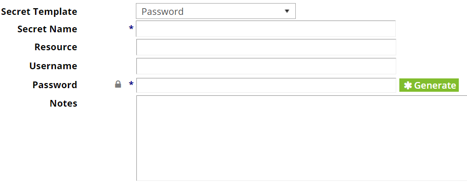

# Secret Server & Python Integration

This repository shows some examples on how to interact with an instance of Secret Server.

## Secret Server
Secret Server is a password management system that enables you to securely store, organize, and manage privileged account information and passwords. You not only can store passwords, but also PGP Keys, SSH Keys and create your own secret templates.

Secret Server also exposes a REST API, which helps applications to take advantage of the tool.

### Free application accounts

If you have an application that needs to store passwords and retrieve them from time to time, you can use Secret Server with application accounts. When an account is used as application account, you don't necessarily need to pay for it, meaning that Secret Server is totally free.

This repository shows some basic commands that will help you to take advantage of Secret Server API's.


## How to use it or test it?

- Clone the project to your local laptop  
``` git clone https://github.com/marcosfreccia/secret-server.git ```

- Create a new virtual environment  
```pip install -m venv "FolderLocation\env"```

- Install the required packages  
``` pip install -r requirements.txt```

- Update the secret_server.cfg with your account or an application account  
```[secret_server_rest_api]```  
```http_address: https://secret-server-url/winauthwebservices/api/v1/```
```[secret_server_credentials]```  
```username: <ServiceAccountOrYourUserName>```
```password: <Password>```

### Examples

- Generate Random Passwords  
``` generate_random_password()```  
This will return a new random password. Every time it is executed, a new password is generated

- Retrieve the id of a secret  
``` retrieve_secret_id("SecretName")```  
This will return the id of the Secret. As Secret Server can search in multiple fields inside a secret, the id will only be returned when what was searched matches with what was found.

- Retrieve the id of a secret  
``` retrieve_group_id("GroupName")```  
This will return the id of a Secret Server Group. This id can be used to update secret permissions for giving a group the rights to own/edit or view a secret.

- Retrieve the password of a Secret  
``` retrieve_secret_password("SecretName")```  
This will return the password of a secret. Passwords can only be retrieved for secrets that you own, or has ***View*** permissions at least.

- Retrieve folder properties  
```retrieve_folder_properties("FolderName")```  
This will return the folder id on which is needed to save a secret. This function is only important for the function add_new_secret, as it needs a folder to save the secret in the moment of the creation.

- Add a new secret  
```add_new_secret("FolderName","NewSecretName","Notes for Identification")```  
This will create a new secret using the template of "Password". A Password template will need the following information presented below.
  - Secret Name: Uses the second parameter from the function
  - Resource: Uses the second parameter from the function
  - Username: Uses the second parameter from the function
  - Password: Automatic password generated during run time
  - Notes: Uses the third parameter from the function



- Share secret with a group  
```share_secret_to_group("SecretName","GroupName","SecretPermission")```  
This will share the secret previously created with a certain group in Secret Server. The group in question, only exists in Secret Server workspace. In addition to that, the only possible permissions are: Owner, Edit, View or List

- Run Active Directory Synchronization  
```run_active_directory_synchronization()```  
This will force a synchronization of users from Active Directory to Secret Server. New users get access to Secret Server via Active Directory group membership. This makes the sync to run right away and synchronize its internal database.